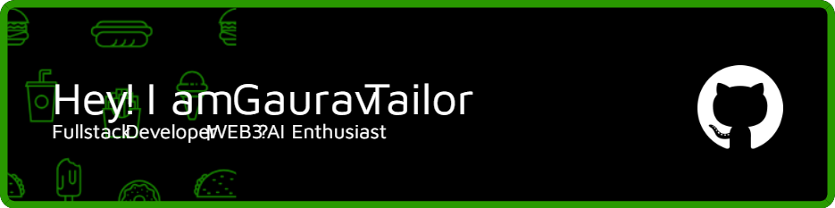

<!-- Banner Image -->

# 👋 Hello, I'm Gaurav Tailor!

I'm a passionate developer based in Jaipur, Rajasthan, India. I specialize in building scalable web applications and have a keen interest in open-source contributions. My journey in tech has been fueled by curiosity and a drive to create impactful solutions.

---

## 🎯 Future Goals

- 🤖 Learn AI for web integration and build intelligent applications
- 🌐 Explore and master Web3 development using Solidity (in progress)
- 🚀 Create production-ready, impactful projects that solve real-world problems
- 📈 Contribute to open-source projects and collaborate with the global developer community
- 🎓 Become a resourceful mentor for beginners in web development and AI
- 🛠️ Optimize performance and scalability of web applications using advanced techniques
- 💡 Start a personal blog or YouTube channel to share knowledge and experiences
- 🧭 Explore DevOps practices and cloud architecture for seamless deployments

---

## 📊 GitHub Statistics

---

## 💻 Tech Stack

### Languages

### Frameworks & Libraries

### Tools & Platforms

---

## 📬 How to Reach Me

- 📧 Email: [tailorg664@gmail.com](mailto:tailorg664@gmail.com)
- 💼 LinkedIn: [linkedin.com/in/gaurav-tailor](https://www.linkedin.com/in/gaurav-tailor-826556250/)
- 🐦 Twitter: [@tailorg664](https://twitter.com/tailorg664)

---

*Let's build something great together! 🚀*

<!--
**tailorg664/tailorg664** is a ✨ _special_ ✨ repository because its `README.md` (this file) appears on your GitHub profile.

Here are some ideas to get you started:

- 🔭 I’m currently working on ...
- 🌱 I’m currently learning ...
- 👯 I’m looking to collaborate on ...
- 🤔 I’m looking for help with ...
- 💬 Ask me about ...
- 📫 How to reach me: ...
- 😄 Pronouns: ...
- ⚡ Fun fact: ...
-->
